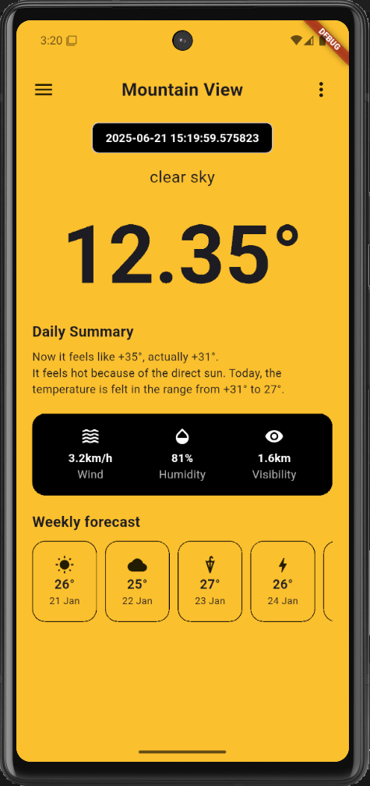

# ☀️ Weather App

Ứng dụng dự báo thời tiết đơn giản sử dụng Flutter, lấy dữ liệu thời tiết theo vị trí hiện tại của người dùng.

## 📦 Tính năng

- Hiển thị thời tiết hiện tại theo vị trí GPS
- Xem thông tin: nhiệt độ, độ ẩm, gió, tầm nhìn
- Dự báo thời tiết các ngày tiếp theo (demo)
- Giao diện đẹp, dễ sử dụng

## 🖼️ Ảnh minh họa
<div align="center">
  
</div>

## ⚙️ Cài đặt

### 🧰 Yêu cầu

- [Flutter](https://flutter.dev/docs/get-started/install) (>=3.x)
- Android Studio hoặc VS Code
- Thiết bị/emulator Android hoặc iOS

### 🚀 Cách chạy

1. **Clone dự án:**
   ```bash
   git clone https://github.com/HaQuangDuy3004/weather_app.git
   cd weather_app-main
   ```

2. **Cài đặt các package:**
   ```bash
   flutter pub get
   ```

3. **Chạy ứng dụng:**
   ```bash
   flutter run
   ```

## 📁 Cấu trúc thư mục

```
lib/
  ├── main.dart
  ├── models/
  ├── services/
  └── widgets/
```

- `models/`: Định nghĩa các model dữ liệu (WeatherModel, ...)
- `services/`: Xử lý API, lấy vị trí, ...
- `widgets/`: Các widget giao diện (WeatherDisplay, WeatherScreen, ...)

## 📝 Ghi chú

- Ứng dụng sử dụng [OpenWeatherMap API](https://openweathermap.org/api). Bạn cần đăng ký và thêm API key vào file cấu hình (nếu có).
- Nếu gặp lỗi về ADB hoặc emulator, hãy kiểm tra lại thiết bị hoặc khởi động lại ADB.

## 🤝 Đóng góp

Mọi đóng góp đều được hoan nghênh! Hãy tạo pull request hoặc issue nếu bạn muốn cải thiện dự án.

## 📄 License

MIT License
